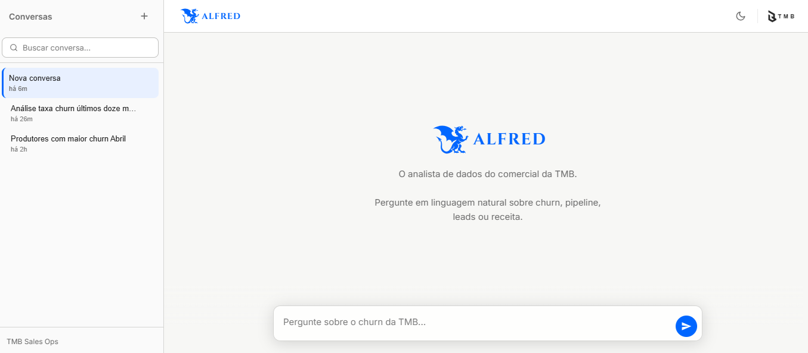
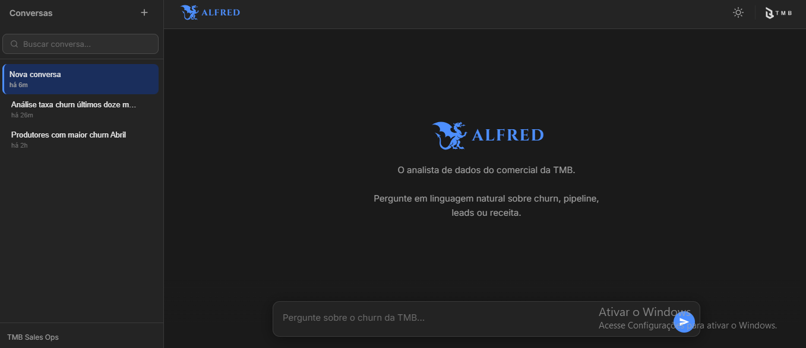

<div align="center">

# Alfred

**O analista de dados do comercial da TMB.**

Pergunte em linguagem natural sobre churn, pipeline, leads ou receita —
o Alfred entende, busca os dados certos e devolve a análise pronta.



</div>

---

## Por que o Alfred existe

A **TMB** é uma fintech de serviços financeiros para infoprodutores (boleto e
Pix parcelado em lançamentos). A operação comercial roda em duas frentes:

- **Retenção** — manter a carteira ativa, controlar churn, acompanhar LTV.
- **Aquisição** — alimentar o funil com novos parceiros via Closer e Growth.

A análise dessas frentes vivia em **Metabase, HubSpot e planilhas**. Cada
pergunta exigia abrir três ferramentas, escrever SQL, cruzar exportações.
O time perdia horas para chegar a respostas que cabem em um parágrafo.

O Alfred substitui esse trabalho por uma conversa. Você pergunta:

> *"Como está a taxa de churn dos últimos 6 meses?"*
> *"Quem entrou em pré-churn em abril na carteira da Rafaela?"*
> *"Dos produtores que fecharam pelo Closer no Q1, quantos churnaram?"*

E recebe uma resposta direta em markdown — com a metodologia TMB,
o filtro temporal correto e a regra de negócio aplicada.

---

## O que o Alfred faz

| Frente | Perguntas que resolve |
|---|---|
| **Churn / Retenção** | Taxa de churn por gestor · transições de status · resumo do mês · streak de gestores acima da meta · valor em risco |
| **LTV e ciclos de vida** | LTV por cluster/gestor · reativações · ciclos de vida · cohorts de primeira venda |
| **Pipeline Closer (HubSpot)** | KPIs do pipeline · ciclo mediano · performance por closer · motivos de perda · detalhe de um deal |
| **Funil Growth (HubSpot)** | Total de leads · MQL/SQL · taxas de conversão · tempo por estágio |
| **Jornada cross-data** | Linha do tempo Growth → Closer → cliente TMB → churn de um produtor específico |

Para a lista completa de tools registradas, ver `agents/tools.py`.

---

## Arquitetura em uma imagem

```mermaid
flowchart LR
    User([👤 Usuário])

    User --> API[FastAPI<br/>POST /chats/&#123;id&#125;/messages]
    API --> Ctx[ContextAgent<br/><i>Haiku</i>]
    Ctx --> Data[DataAgent]

    Data --> Specialists{áreas?}
    Specialists -->|retention| Ret[RetentionAgent<br/><i>Sonnet · ReAct</i>]
    Specialists -->|acquisition| Acq[AcquisitionAgent<br/><i>Sonnet · ReAct</i>]

    Ret --> Report[ReportAgent<br/><i>Sonnet</i>]
    Acq --> Report
    Report --> User

    Data -.lê.-> Sources[(Metabase · HubSpot<br/>+ cache parquet)]
```



**Quatro estágios:**

1. **Classificar** — o ContextAgent (Haiku) lê a pergunta e devolve
   um `IntentContract`: quais áreas (retention/acquisition/ambas),
   período resolvido, identidade do gestor, regras de negócio aplicáveis.
2. **Carregar** — o DataAgent traz apenas o que a intenção exige.
   Metabase para retention, parquet do HubSpot para acquisition.
3. **Analisar** — Retention e/ou Acquisition rodam um loop ReAct (Sonnet)
   chamando tools que executam pandas via `analytics_agent`. Para perguntas
   mistas, os dois rodam em paralelo.
4. **Formatar** — o ReportAgent transforma o `AnalyticsResult` em markdown
   em pt-BR, com tabelas e narrativa.

Para o detalhamento de cada agente, regras de status, modelos e estado de
sessão, ver [CLAUDE.md](CLAUDE.md).

---

## Interface

<div align="center">

| Light | Dark |
|---|---|
|  |  |

</div>

O frontend é uma SPA em HTML + CSS + JS vanilla servida pelo FastAPI.
Tem histórico de conversas (sidebar com busca), troca de tema light/dark e
título de chat gerado automaticamente pelo Haiku. Identidade visual em
`DESIGN.md` e `design/`.

---

## Stack

| Camada | Tecnologia |
|---|---|
| Backend | FastAPI + Uvicorn |
| LLMs | Anthropic Claude — **Sonnet 4.x** (análise) + **Haiku 4.5** (classificação) |
| Dados de retenção | Metabase API (cards 189 e 194) → pandas |
| Dados de aquisição | HubSpot API → parquet local |
| Cache | Parquet em `cache/` com TTL configurável (padrão 4h) |
| Persistência de chats | SQLite (`data/chats.db`) |
| Frontend | HTML/CSS/JS vanilla, tokens em `design/` |

---

## Estrutura de arquivos

```
.
├── ui/
│   ├── app.py                  FastAPI · entry point (uvicorn ui.app:app)
│   ├── index.html              Frontend (SPA single-file)
│   ├── storage.py              SQLite — histórico de chats
│   └── static/                 Favicon, logo, assets
│
├── agents/
│   ├── orchestrator.py         Pipeline principal
│   ├── context_agent.py        Classificação de intenção (Haiku)
│   ├── data_agent.py           Empacotamento de DataFrames
│   ├── retention_agent.py      ReAct — churn, LTV, cohort
│   ├── acquisition_agent.py    ReAct — Closer, Growth, jornada
│   ├── analytics_agent.py      Engine pandas (_calc_* functions)
│   ├── hubspot_analytics.py    Cálculos específicos do HubSpot
│   ├── tools.py                Wrappers de tools (CLAUDE_TOOLS, TOOL_AREAS)
│   └── report_agent.py         Formatação markdown final
│
├── design/                     Tokens, logo, regras visuais
├── data/                       Parquets HubSpot + chats.db
├── cache/                      Parquets de fVendas/dProdutores
├── logs/                       Logs rotativos
├── images/                     Screenshots usados neste README
│
├── data_loader.py              Metabase API + cache parquet
├── hubspot_importer.py         Refresh Closer
├── hubspot_growth_importer.py  Refresh Growth
├── refresh_hubspot.py          Roda os dois importers acima
├── prompts.py                  System prompts de todos os agentes
├── config.py                   Settings + logger
├── CLAUDE.md                   Contexto completo para o agente Claude
├── DESIGN.md                   Manifesto da identidade visual
├── Procfile                    Deploy (Heroku/Railway)
└── requirements.txt
```

---

## Rodando localmente

### 1. Variáveis de ambiente

Copie `.env.example` para `.env` e preencha:

```bash
cp .env.example .env
```

| Variável | Obrigatória | Descrição |
|---|---|---|
| `ANTHROPIC_API_KEY` | ✅ | Chave da API Anthropic |
| `METABASE_URL` | ✅ | URL da instância Metabase |
| `METABASE_USER` | ✅ | E-mail de login no Metabase |
| `METABASE_PASSWORD` | ✅ | Senha do Metabase |
| `HUBSPOT_TOKEN` | — | Token HubSpot (só para `refresh_hubspot.py`) |
| `CLAUDE_MODEL` | — | Modelo de análise (padrão `claude-sonnet-4-6`) |
| `CLAUDE_HAIKU_MODEL` | — | Modelo de classificação (padrão `claude-haiku-4-5-20251001`) |
| `CACHE_DIR` | — | Pasta do cache parquet (padrão `./cache`) |
| `CACHE_MAX_AGE_HOURS` | — | TTL do cache em horas (padrão `4`) |
| `LOG_DIR` | — | Pasta de logs (padrão `./logs`) |
| `LOG_LEVEL` | — | Nível de log (padrão `INFO`) |

### 2. Instalar dependências

```bash
pip install -r requirements.txt
```

###