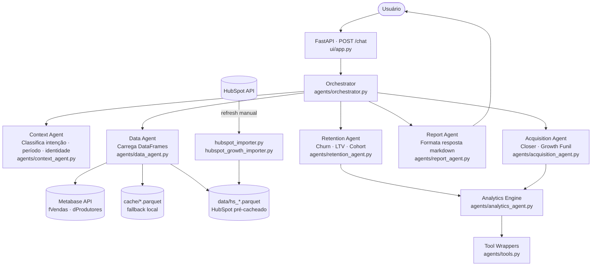

# Alfred — TMB Churn Analyzer

Agente conversacional multi-camada para análise de churn, LTV e funil de aquisição da **TMB** (fintech de serviços financeiros para infoprodutores).

Alfred recebe perguntas em linguagem natural, identifica a intenção, carrega os dados certos e devolve respostas estruturadas com métricas de negócio — sem SQL, sem dashboards, sem complexidade.

---

## Arquitetura



### Fluxo de uma pergunta

1. **FastAPI** recebe `POST /chat` com `{message, session_id}`
2. **Orchestrator** coordena o pipeline completo
3. **Context Agent** classifica a intenção (churn / closer / growth / greeting), extrai período e resolve identidade do usuário
4. **Data Agent** carrega `fVendas` e `dProdutores` do Metabase (ou do cache parquet como fallback)
5. **Retention Agent** ou **Acquisition Agent** executa um loop ReAct com as tools registradas em `tools.py`
6. **Analytics Engine** despacha para funções pandas específicas (`_calc_*`) e devolve `summary + tabular`
7. **Report Agent** formata o resultado como markdown legível via Claude

---

## Estrutura de arquivos

```
alfred-agent/
├── ui/
│   ├── app.py                  # FastAPI backend (entry point)
│   ├── index.html              # Chat UI
│   └── static/                 # Favicon, logo
│
├── agents/
│   ├── orchestrator.py         # Pipeline principal
│   ├── context_agent.py        # Classificação de intenção e contexto
│   ├── data_agent.py           # Carregamento e empacotamento de dados
│   ├── retention_agent.py      # ReAct loop — análise de churn/LTV/cohort
│   ├── acquisition_agent.py    # ReAct loop — Closer pipeline e Growth funil
│   ├── analytics_agent.py      # Engine de cálculo pandas (_calc_* functions)
│   ├── hubspot_analytics.py    # Cálculos específicos do HubSpot
│   ├── report_agent.py         # Formatação da resposta final
│   └── tools.py                # Wrappers de tools para o ReAct (CLAUDE_TOOLS)
│
├── data/
│   ├── hs_closer_pipeline.parquet   # Cache HubSpot Closer (gerado por hubspot_importer.py)
│   └── hs_growth_leads.parquet      # Cache HubSpot Growth (gerado por hubspot_growth_importer.py)
│
├── cache/                      # Parquet de fVendas e dProdutores (fallback Metabase)
├── logs/                       # Logs rotativos da aplicação
│
├── config.py                   # Settings + logger (carrega .env)
├── data_loader.py              # Cliente Metabase API com fallback para parquet
├── prompts.py                  # System prompts de todos os agentes
│
├── hubspot_importer.py         # Utilitário: atualiza cache Closer → data/
├── hubspot_growth_importer.py  # Utilitário: atualiza cache Growth → data/
├── refresh_hubspot.py          # Orquestra os dois importers acima
│
├── requirements.txt
├── Procfile                    # Deploy Heroku/Railway: uvicorn ui.app:app
└── .env.example
```

---

## Stack

| Camada | Tecnologia |
|---|---|
| Backend | FastAPI + Uvicorn |
| LLM | Anthropic Claude (Sonnet 4.x para análise, Haiku para classificação) |
| Dados operacionais | Metabase API → pandas DataFrames |
| Dados de aquisição | HubSpot API → parquet local |
| Manipulação | pandas, openpyxl |
| Config | python-dotenv |

---

## Como rodar localmente

### 1. Variáveis de ambiente

Copie `.env.example` para `.env` e preencha:

```bash
cp .env.example .env
```

| Variável | Obrigatória | Descrição |
|---|---|---|
| `ANTHROPIC_API_KEY` | ✅ | Chave da API Anthropic |
| `METABASE_URL` | ✅ | URL da instância Metabase (ex: `https://metabase.tmb.com.br`) |
| `METABASE_USER` | ✅ | E-mail de login no Metabase |
| `METABASE_PASSWORD` | ✅ | Senha do Metabase |
| `METABASE_DB_ID` | — | ID do banco no Metabase (padrão: `3`) |
| `METABASE_TABLE_VENDAS` | — | ID da tabela fVendas (padrão: `645`) |
| `METABASE_TABLE_PRODUTORES` | — | ID da tabela dProdutores (padrão: `626`) |
| `HUBSPOT_TOKEN` | — | Token da API HubSpot (só para refresh de dados) |
| `CLAUDE_MODEL` | — | Modelo principal (padrão: `claude-sonnet-4-6`) |
| `CLAUDE_HAIKU_MODEL` | — | Modelo de roteamento (padrão: `claude-haiku-4-5-20251001`) |
| `CACHE_DIR` | — | Pasta de cache parquet (padrão: `./cache`) |
| `CACHE_MAX_AGE_HOURS` | — | TTL do cache em horas (padrão: `4`) |
| `LOG_DIR` | — | Pasta de logs (padrão: `./logs`) |

### 2. Instalar dependências

```bash
pip install -r requirements.txt
```

### 3. Iniciar o servidor

```bash
uvicorn ui.app:app --reload --port 8000
```

Acesse [http://localhost:8000](http://localhost:8000)

---

## Refresh de dados HubSpot

Os arquivos `data/hs_closer_pipeline.parquet` e `data/hs_growth_leads.parquet` são gerados offline e lidos pela aplicação como cache estático. Para atualizá-los:

```bash
python refresh_hubspot.py
```

Ou individualmente:

```bash
python hubspot_importer.py         # atualiza Closer pipeline
python hubspot_growth_importer.py  # atualiza Growth leads
```

Recomenda-se rodar semanalmente (ou antes de análises de funil relevantes).

---

## Dados e regras de negócio

### Tabelas principais

| Tabela | Chave | Descrição |
|---|---|---|
| `fVendas` | `Código`, `Data` | Uma linha por produtor por mês. Contém `Status` e `Valor`. |
| `dProdutores` | `Código` | Dimensão de produtores: `Cluster`, `Gestor`, `Data Parceria`. |

### Status dos produtores

- **Ativo** — vendeu no período recente
- **Pré-churn** — em risco (última venda há algum tempo)
- **Churn** — saiu da base (vendeu mas parou)
- **Inativo** — nunca vendeu (≠ Churn)

### Regra de ouro temporal

O histórico completo já está em `fVendas` linha a linha. Consultas de meses passados filtram `Data` pelo mês/ano exato — nunca assumem o mês mais recente quando um período específico é solicitado.

---

## Deploy

```
# Procfile (Heroku / Railway)
web: uvicorn ui.app:app --host 0.0.0.0 --port $PORT
```
